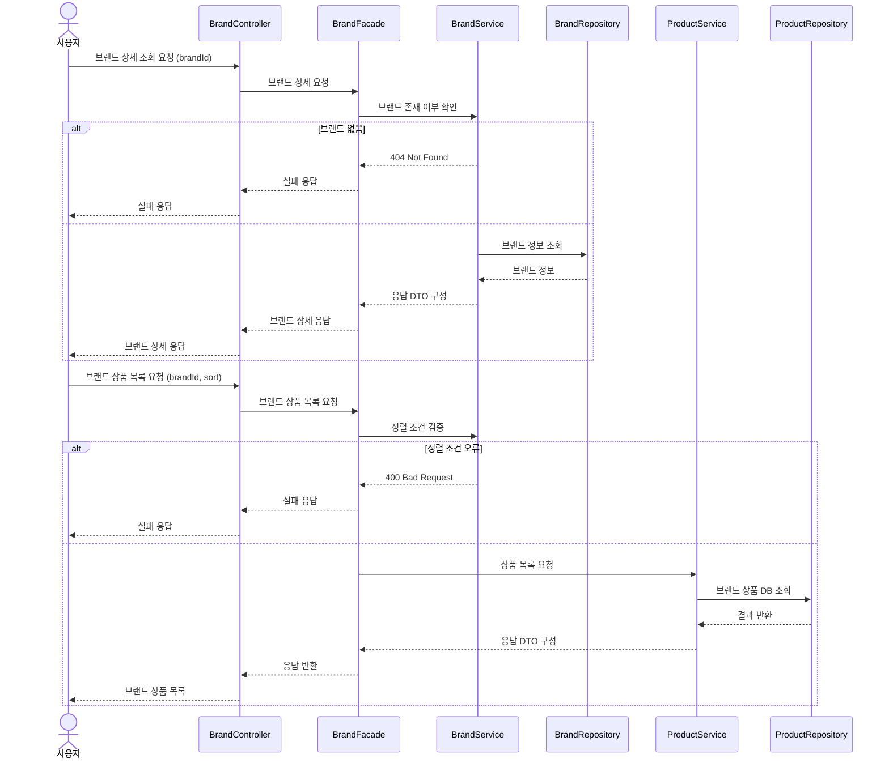

### 🏷 브랜드 (Brand)

```mermaid
sequenceDiagram
actor U as 사용자
participant BC as BrandController
participant BF as BrandFacade
participant BS as BrandService
participant BR as BrandRepository
participant PS as ProductService
participant PR as ProductRepository

U ->> BC: 브랜드 상세 조회 요청 (brandId)
BC ->> BF: 브랜드 상세 요청
BF ->> BS: 브랜드 존재 여부 확인
alt 브랜드 없음
    BS -->> BF: 404 Not Found
    BF -->> BC: 실패 응답
    BC -->> U: 실패 응답
else
    BS ->> BR: 브랜드 정보 조회
    BR -->> BS: 브랜드 정보
    BS -->> BF: 응답 DTO 구성
    BF -->> BC: 브랜드 상세 응답
    BC -->> U: 브랜드 상세 응답
end

U ->> BC: 브랜드 상품 목록 요청 (brandId, sort)
BC ->> BF: 브랜드 상품 목록 요청
BF ->> BS: 정렬 조건 검증
alt 정렬 조건 오류
    BS -->> BF: 400 Bad Request
    BF -->> BC: 실패 응답
    BC -->> U: 실패 응답
else
    BF ->> PS: 상품 목록 요청
    PS ->> PR: 브랜드 상품 DB 조회
    PR -->> PS: 결과 반환
    PS -->> BF: 응답 DTO 구성
    BF -->> BC: 응답 반환
    BC -->> U: 브랜드 상품 목록
end
```
