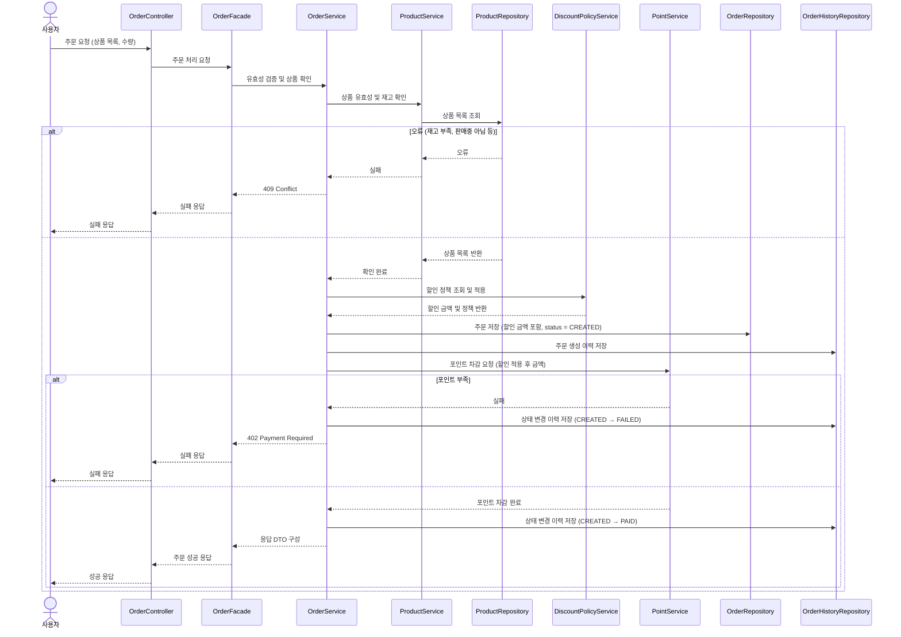

### 🧾 주문 (Order)

```mermaid
sequenceDiagram
    actor U as 사용자
    participant OC as OrderController
    participant OF as OrderFacade
    participant OS as OrderService
    participant PS as ProductService
    participant PR as ProductRepository
    participant DP as DiscountPolicyService
    participant PT as PointService
    participant OR as OrderRepository
    participant OHR as OrderHistoryRepository

    U ->> OC: 주문 요청 (상품 목록, 수량)
    OC ->> OF: 주문 처리 요청
    OF ->> OS: 유효성 검증 및 상품 확인
    OS ->> PS: 상품 유효성 및 재고 확인
    PS ->> PR: 상품 목록 조회
    alt 오류 (재고 부족, 판매중 아님 등)
        PR -->> PS: 오류
        PS -->> OS: 실패
        OS -->> OF: 409 Conflict
        OF -->> OC: 실패 응답
        OC -->> U: 실패 응답
    else
        PR -->> PS: 상품 목록 반환
        PS -->> OS: 확인 완료
        OS ->> DP: 할인 정책 조회 및 적용
        DP -->> OS: 할인 금액 및 정책 반환
        OS ->> OR: 주문 저장 (할인 금액 포함, status = CREATED)
        OS ->> OHR: 주문 생성 이력 저장

        OS ->> PT: 포인트 차감 요청 (할인 적용 후 금액)
        alt 포인트 부족
            PT -->> OS: 실패
            OS ->> OHR: 상태 변경 이력 저장 (CREATED → FAILED)
            OS -->> OF: 402 Payment Required
            OF -->> OC: 실패 응답
            OC -->> U: 실패 응답
        else
            PT -->> OS: 포인트 차감 완료
            OS ->> OHR: 상태 변경 이력 저장 (CREATED → PAID)
            OS -->> OF: 응답 DTO 구성
            OF -->> OC: 주문 성공 응답
            OC -->> U: 성공 응답
        end
    end

```