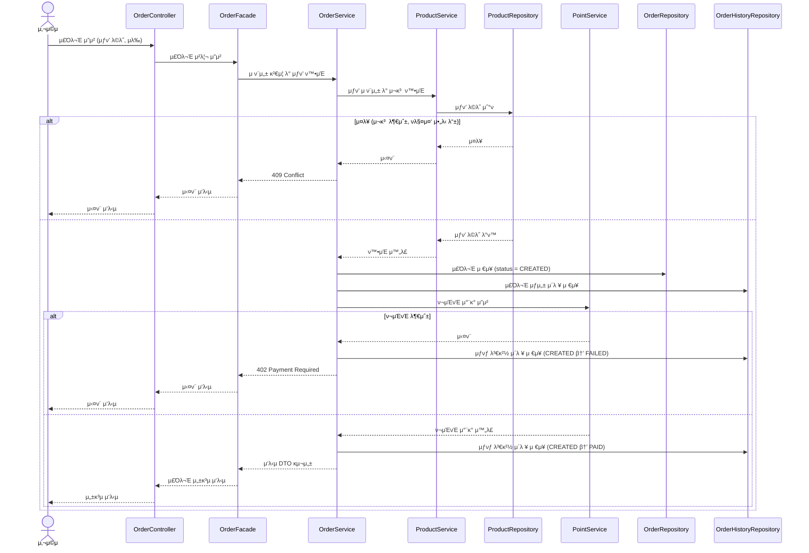

### π§Ύ μ£Όλ¬Έ (Order)

```mermaid
sequenceDiagram
    actor U as 사μ©μ
    participant OC as OrderController
    participant OF as OrderFacade
    participant OS as OrderService
    participant PS as ProductService
    participant PR as ProductRepository
    participant PT as PointService
    participant OR as OrderRepository
    participant OHR as OrderHistoryRepository

    U ->> OC: μ£Όλ¬Έ μ”μ²­ (μƒν’ λ©λ΅, μλ‰)
    OC ->> OF: μ£Όλ¬Έ μ²λ¦¬ μ”μ²­
    OF ->> OS: μ ν¨μ„± κ²€μ¦ λ° μƒν’ ν™•μΈ
    OS ->> PS: μƒν’ μ ν¨μ„± λ° μ¬κ³  ν™•μΈ
    PS ->> PR: μƒν’ λ©λ΅ μ΅°ν
    alt μ¤λ¥ (μ¬κ³  부족, ν매중 μ•„λ‹ λ“±)
        PR -->> PS: μ¤λ¥
        PS -->> OS: 실ν¨
        OS -->> OF: 409 Conflict
        OF -->> OC: μ‹¤ν¨ μ‘λ‹µ
        OC -->> U: μ‹¤ν¨ μ‘λ‹µ
    else
        PR -->> PS: μƒν’ λ©λ΅ λ°ν™
        PS -->> OS: ν™•μΈ μ™„λ£
        OS ->> OR: μ£Όλ¬Έ μ €μ¥ (status = CREATED)
        OS ->> OHR: μ£Όλ¬Έ μƒμ„± μ΄λ ¥ μ €μ¥

        OS ->> PT: ν¬μΈνΈ μ°¨κ° μ”μ²­
        alt ν¬μΈνΈ 부족
            PT -->> OS: 실ν¨
            OS ->> OHR: μƒνƒ λ³€κ²½ μ΄λ ¥ μ €μ¥ (CREATED β†’ FAILED)
            OS -->> OF: 402 Payment Required
            OF -->> OC: μ‹¤ν¨ μ‘λ‹µ
            OC -->> U: μ‹¤ν¨ μ‘λ‹µ
        else
            PT -->> OS: ν¬μΈνΈ μ°¨κ° μ™„λ£
            OS ->> OHR: μƒνƒ λ³€κ²½ μ΄λ ¥ μ €μ¥ (CREATED β†’ PAID)
            OS -->> OF: μ‘λ‹µ DTO 구성
            OF -->> OC: μ£Όλ¬Έ μ„±κ³µ μ‘λ‹µ
            OC -->> U: μ„±κ³µ μ‘λ‹µ
        end
    end

```